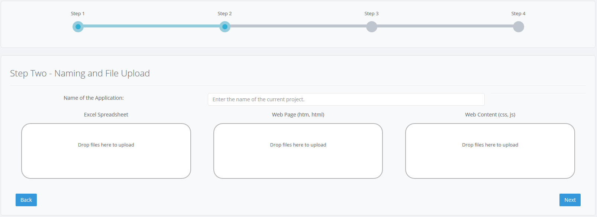

# SpreadsheetWeb Custom Web Pages Examples

SpreadsheetWeb is a platform for building and generating web applications and complex calculation engines from Excel models. The software is produced and distributed by Pagos Inc.

This repository contains a few samples that demonstrate how to build web pages connected to calculation-based web services using the SpreadsheetWeb platform. 

> The samples can be used only with SpreadsheetWeb Server Packages - you need to have an active [server licence](https://www.spreadsheetweb.com/server-pricing/).

## Download

If you have a `git` command line installed in your computer, you can download all of the samples by running:

```bash
> git clone https://github.com/spreadsheetweb/samples-custom-web-pages
```

Alternatively, you can click the `Clone or Download` button on the GitHub page.

## How to run

In order to see any of these examples in action, you need to do the following:

1. Create a **Custom Web Page Service** application. See [this link](https://pagosinc.atlassian.net/wiki/spaces/SSWEB/pages/35954/Custom+Applications) for additional details.
    You will be prompted to upload the following files when creating the application: 
    - An Excel calculation file (e.g. *Find Interest Rate with Goal Seek/Goal-Seek-Tutorial.xlsx*)
    - An HTML file (e.g. *Find Interest Rate with Goal Seek/GoalSeek-InterestRate-5.0.html*)
    - A zipped web content folder (e.g. *Find Interest Rate with Goal Seek/Content.zip*)
    
    
    
    Drop each of the files into the corresponding box, as shown in the screenshot above.
    
    > If you modified any of the files under the *Content* folder, then you need to compress it into a ZIP file. This can be done by right-clicking the *Content* folder in Windows File Explorer and then selecting "Send to: Compressed (zipped) folder".

    
3. Submit the application to the SpreadsheetWeb system (i.e. *Save* button).
4. Access the application from the applications screen or using the Go To Application button.


## Examples Description

### Find Interest Rate with Goal Seek
This model calculates the target interest rate on a loan using the goal seek algorithm.

### Investment Calculator with Monte Carlo Simulation
This model provides an estimation of an investment using Monte Carlo simulation.

### Unit Converter
This model converts various forms of unit between one another.
